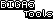

[](https://unity3d.com)


The tools i usually use for all of my game development with unity.

[](Assets/CHANGELOG.md)

[](https://discordapp.com/users/413483007492751370)  


# Features
 - A powerful timer class
 - Controllers for audio and resources
 - A powerful state controller
 - Tag system 
 - A pool system

# Doc
 ## Timer class
A non-monobehaviour class that you can use to create a timer inside any script. You can add a function for when its completed and choose if it loops or not.
```
A base syntax for the timer looks like this:

Timer myTimer;

private void Start(){
    myTimer = new Timer(5, true);
    myTimer.OnComplete += TimerFinish;
}
private void Update(){
    myTimer.Update();
}
```
# Controllers
 ## State Controller
This script will be able to manage the state you game are in, you can add new enums to better control it.
```
The state controller has a static reference (StateController.Instance) and you can use:

StateController.ChangeState(States.YOUR_STATE)

To change the state you are in, it's useful for pauses and/or update checks.
```

# Pool System
The pool system comes with a powerful way of instantiating and "destroying" objects without using too much performance, you can set as many pools as you want and use ids to reference them. So in the end you are able to get an enemy like this:
```
PoolsManager.Instance.GetPool("Enemy")?.GetFromPool(this.transform.position);
```
